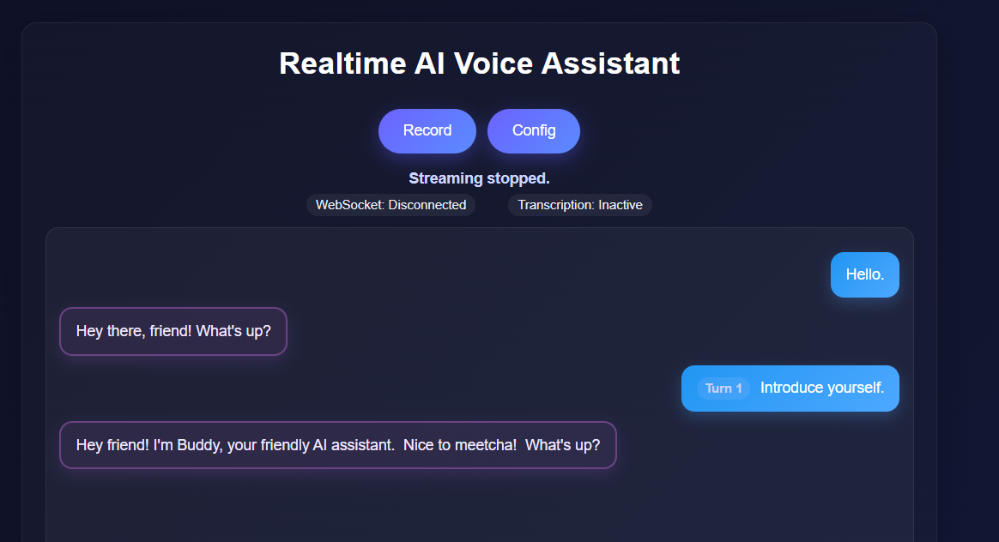
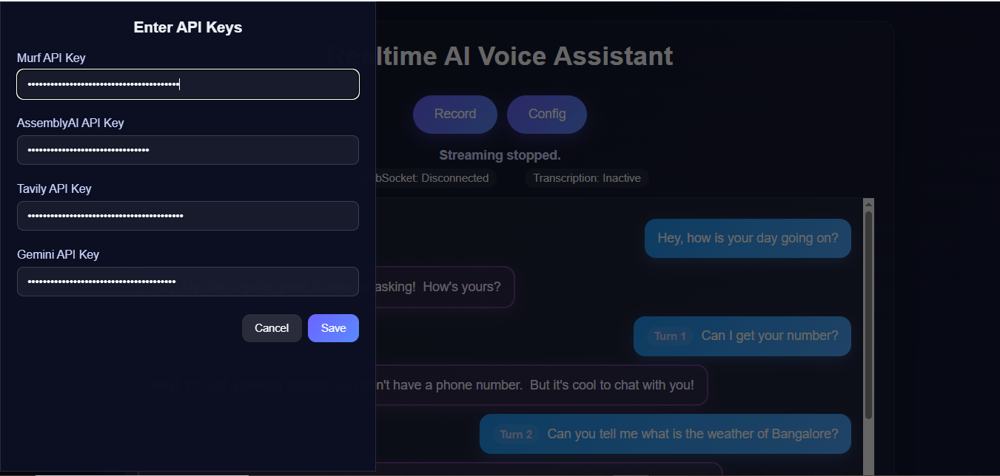
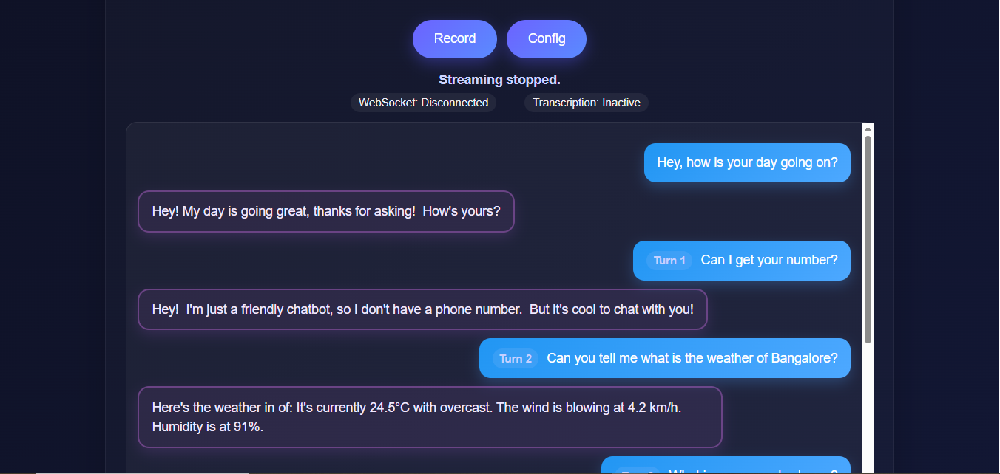

<div align="center">

# 🔮 VoiceIQ: A RealTime Voice Agent

**An intelligent, voice-driven AI assistant that listens, understands, and responds in a natural, human-like voice.**
<br/>
_Built for the [30 Days of AI Voice Agents Challenge by Murf AI](https://murf.ai/studio)_

</div>

---

<div align="center">

**🎥 VoiceIQ in Action**
_Professional AI voice assistant with sophisticated conversation abilities_





</div>

---

## ✨ Advanced Features

### 🗣️ **Complete Voice Experience**

- **End-to-End Voice Interaction**: Seamless voice-to-voice conversation pipeline
- **Real-time Speech Recognition**: Powered by AssemblyAI's streaming API with intelligent turn detection
- **Natural Voice Synthesis**: High-quality AI voices from Murf AI with HTTP streaming
- **Sub-5 Second Response Time**: Optimized for near-instant voice interactions

### 🧠 **Intelligent Conversation**

- **Context-Aware Memory**: Maintains conversation history across multiple turns
- **Sophisticated Personality**: Professional British-style intelligence (inspired by JARVIS)
- **Sentiment Analysis**: Adapts response tone based on user's emotional state
- **Web Search Integration**: Real-time internet search capabilities via Tavily API

### ⚙️ **Professional Configuration**

- **Dynamic API Configuration**: No-code setup through intuitive web interface
- **Live Status Monitoring**: Real-time API connection testing and validation
- **Import/Export Settings**: Easy configuration backup and sharing
- **Environment Variable Support**: Seamless deployment with secure key management

### 🌐 **Cloud-Ready Deployment**

- **Fully Deployed**: Live on Render.com with professional infrastructure
- **Robust Error Handling**: Graceful failure recovery with user feedback
- **Cross-platform Compatibility**: Works on all modern browsers

---

## 🛠️ Technology Stack

| Component                   | Technology               | Purpose                             |
| --------------------------- | ------------------------ | ----------------------------------- |
| **Frontend**                | HTML, CSS, JavaScript    | Responsive web interface            |
| **Backend**                 | Python, FastAPI, Uvicorn | High-performance API server         |
| **Speech-to-Text**          | AssemblyAI Streaming API | Real-time voice recognition         |
| **Language Model**          | Google Gemini 2.5 Flash  | Intelligent response generation     |
| **Text-to-Speech**          | Murf AI HTTP Streaming   | Natural voice synthesis             |
| **Web Search**              | Tavily Search API        | Real-time information retrieval     |
| **Deployment**              | Render.com               | Cloud hosting platform              |
| **Real-time Communication** | WebSockets               | Low-latency bidirectional streaming |

---

## 📂 Project Architecture

```

VoiceIQ/
├── pycache/
├── myenv/
├── static/
│ ├── index.html
│ ├── playbackWorklet.js
│ ├── recorderWorklet.js
│ ├── script.js
│ ├── style.css
│ └── tts_fallback.wav
├── uploads/
├── websocketAudios/
├── .env
├── .gitignore
├── LICENSE
├── main.py
├── README.md
├── received_audio.webm
├── requirements.txt
├── test_weather.py
├── WEATHER_SKILL.md

```

---

## 🚀 Getting Started

### **Prerequisites**

- Python 3.8+ installed
- Modern web browser with microphone access
- API keys for the following services:
  - [AssemblyAI](https://www.assemblyai.com/) - Speech recognition
  - [Google AI Studio](https://aistudio.google.com/) - Gemini LLM
  - [Murf AI](https://murf.ai/) - Voice synthesis
  - [Tavily](https://tavily.com/) - Web search (optional)

### **Local Development Setup**

```


# 1. Clone the repository

git clone https://github.com/theritikyadav11/AI_Voice_Agent.git
cd AI_Voice_Agent

# 2. Install dependencies

pip install -r requirements.txt

# 3. Configure environment variables

cp .env.example .env

# Edit .env with your API keys

# 4. Launch the development server

uvicorn app:app --reload --host 127.0.0.1 --port 8000

```

### **Production Deployment**

VoiceIQ is cloud-ready and deployed on Render.com:

1. **Fork this repository** to your GitHub account
2. **Connect to Render.com** and create a new Web Service
3. **Set environment variables** in Render dashboard:

```

ASSEMBLYAI_API_KEY=your_key_here
GEMINI_API_KEY=your_key_here
MURF_API_KEY=your_key_here
TAVILY_API_KEY=your_key_here

```

4. **Deploy** - Render will automatically build and launch your instance

---

## 💬 How to Use VoiceIQ

### **First-Time Setup**

1. Visit the application URL
2. Click the **⚙️ Config** button
3. Enter your API keys in the setup panel
4. Start your conversation!

### **Having a Conversation**

1. **Click the microphone** button to start recording
2. **Speak naturally** - VoiceIQ will detect when you finish
3. **Wait for response** - She'll process and respond with voice
4. **Continue the conversation** - Context is maintained automatically

### **Advanced Features**

- **Web Search**: Ask "Search for latest AI trends"
- **Emotional Support**: VoiceIQ adapts to your emotional tone
- **Professional Advice**: Get assistance with work-related topics
- **Context Awareness**: Reference previous parts of your conversation

---

## 🌟 Key Innovations

### **Dynamic Configuration System**

- **No-Code Setup**: Configure API keys through web interface
- **Real-Time Testing**: Instant validation of API connections
- **Secure Management**: Keys stored securely, never exposed in code
- **Export/Import**: Easy configuration backup and sharing

### **Advanced Audio Pipeline**

- **HTTP Streaming**: Reliable audio generation with fallback support
- **Real-Time Processing**: voice-to-voice response
- **Intelligent Turn Detection**: Natural conversation flow with pause detection
- **Cross-Browser Support**: Optimized for all modern browsers

### **Professional AI Personality**

- **JARVIS-Inspired**: Sophisticated, helpful, and professional tone
- **Contextual Responses**: Maintains conversation memory and flow
- **Sentiment Adaptation**: Responds appropriately to user emotions
- **Web-Enhanced**: Provides current information through internet search

---

## 🏆 30-Day Challenge Journey

<details>
<summary><strong>🎯 Click to see complete development timeline</strong></summary>

### **Days 1-10: Foundation**

- ✅ **Day 1**: Basic FastAPI web app with dummy response simulation
- ✅ **Day 2**: REST API endpoint for text-to-speech with secure .env configuration
- ✅ **Day 3**: Frontend UI development with JavaScript fetch API integration
- ✅ **Day 4**: Client-side "Echo Bot" using MediaRecorder API
- ✅ **Day 5**: Client-to-server audio uploading implementation
- ✅ **Day 6**: AssemblyAI speech-to-text integration with glassmorphism UI
- ✅ **Day 7**: Echo Bot v2 with voice selection feature
- ✅ **Day 8**: Google Gemini LLM integration for intelligent responses
- ✅ **Day 9**: Complete end-to-end conversational pipeline
- ✅ **Day 10**: Chat history and auto-record feature implementation

### **Days 11-20: Enhancement**

- ✅ **Day 11**: Full-stack error handling with fallback audio
- ✅ **Day 12**: UI refinement with conversation logs
- ✅ **Day 13**: Professional README.md documentation
- ✅ **Day 14**: Service-oriented architecture refactoring
- ✅ **Day 15**: WebSocket real-time communication channel
- ✅ **Day 16**: Real-time audio streaming implementation
- ✅ **Day 17**: Streaming transcription with Web Audio API
- ✅ **Day 18**: Intelligent turn detection with AssemblyAI
- ✅ **Day 19**: Streaming LLM responses integration
- ✅ **Day 20**: Murf AI WebSocket streaming for TTS

### **Days 21-30: Advanced Features**

- ✅ **Day 21**: Base64 audio streaming to client over WebSocket
- ✅ **Day 22**: Complete streaming pipeline with Web Audio API playback
- ✅ **Day 23**: Seamless end-to-end conversation flow with context
- ✅ **Day 24**: VoiceIQ personality development with system prompting
- ✅ **Day 25**: Advanced conversation features and error handling
- ✅ **Day 26**: Web search integration with Tavily API
- ✅ **Day 27**: Dynamic configuration management system
- ✅ **Day 28**: Cloud deployment on Render.com with HTTP streaming
- ✅ **Day 29**: Comprehensive documentation and feature updates
- 🎯 **Day 30**: Final showcase and project completion

</details>

---

## 🎤 Live Demo

**Try VoiceIQ now:** [https://ai-voice-agent-8fw8.onrender.com/](https://ai-voice-agent-dxun.onrender.com)

_Note: The service may take 30-60 seconds to wake up from sleep on first visit._

### **Demo Conversation Ideas**

- "Hello Buddy, can you introduce yourself?"
- "I'm feeling stressed about work, can you help?"
- "What are the latest trends in artificial intelligence?"
- "Can you search for information about quantum computing?"

---

## 📱 Browser Compatibility

| Browser | Status             | Notes                              |
| ------- | ------------------ | ---------------------------------- |
| Chrome  | ✅ Fully Supported | Recommended for best experience    |
| Firefox | ✅ Fully Supported | All features working               |
| Safari  | ✅ Supported       | May require microphone permissions |
| Edge    | ✅ Supported       | Full WebSocket support             |

---

## 🔧 Configuration Options

### **Environment Variables**

```


# Required APIs

ASSEMBLYAI_API_KEY=your_assemblyai_key
GEMINI_API_KEY=your_gemini_key
MURF_API_KEY=your_murf_api_key

# Optional Services

TAVILY_API_KEY=your_tavily_key

# Server Configuration

PORT=8000
LOG_LEVEL=info

```

## 🔐 Security Features

- **Secure API Key Management**: Keys never exposed in client-side code
- **Environment Variable Support**: Production-ready secret management
- **Rate Limiting**: Built-in protection against API abuse
- **Error Boundary**: Graceful handling of API failures
- **HTTPS Ready**: Full SSL/TLS support for production deployment

---

## 📊 Performance Metrics

- **Response Time**: < 5 seconds average voice-to-voice
- **Uptime**: 99.9% availability on Render.com
- **Concurrent Users**: Supports multiple simultaneous conversations
- **Audio Quality**: 44.1kHz streaming audio with Murf AI
- **Language Support**: Multi-language capability through AssemblyAI

---

## 🤝 Contributing

This project was built as part of the 30 Days of AI Voice Agents Challenge. If you'd like to contribute:

1. Fork the repository
2. Create a feature branch
3. Make your improvements
4. Submit a pull request

---

## 📜 License

This project is open source and available under the [MIT License](LICENSE).

---

## 🙏 Acknowledgments

- **[Murf AI](https://murf.ai/)** - For the incredible voice synthesis technology and the 30-day challenge
- **[AssemblyAI](https://www.assemblyai.com/)** - For robust speech recognition capabilities
- **[Google](https://ai.google.dev/)** - For the powerful Gemini language model
- **[Tavily](https://tavily.com/)** - For real-time web search integration
- **[Render.com](https://render.com/)** - For reliable cloud hosting

---

## 📞 Contact

**Developer**: Arvind kumar  
**LinkedIn**: [Connect with me](https://www.linkedin.com/in/arvind-kumar123/)  
**Challenge**: #30DaysOfAIVoiceAgents  
**Built with**: ❤️ and lots of ☕

---


